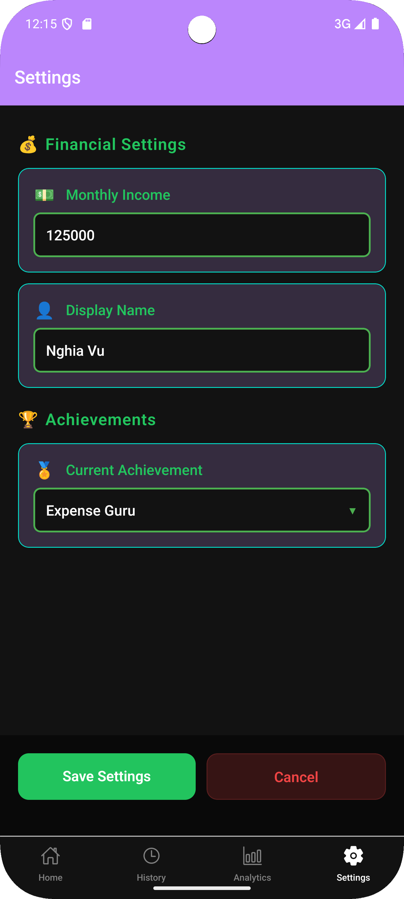

# 💰 PennyPal - Personal Finance Tracker

> A React Native mobile app that helps users discipline their spending habits through smart categorization and data-driven insights.

[](https://reactnative.dev/)
[](https://expo.dev/)
[](LICENSE)

## 🎥 App Demo Videos

### Complete App Walkthrough
<div align="center">
  <table>
    <tr>
      <td align="center">
        <video width="250" controls>
          <source src="./assets/demo/OnBoard.mp4" type="video/mp4">
          Your browser does not support the video tag.
        </video>
        <br><b>Onboarding Flow</b>
      </td>
      <td align="center">
        <video width="250" controls>
          <source src="./assets/demo/Home.mp4" type="video/mp4">
          Your browser does not support the video tag.
        </video>
        <br><b>Home Dashboard</b>
      </td>
      <td align="center">
        <video width="250" controls>
          <source src="./assets/demo/MonthlySummary.mp4" type="video/mp4">
          Your browser does not support the video tag.
        </video>
        <br><b>Monthly Summary</b>
      </td>
    </tr>
    <tr>
      <td align="center">
        <video width="250" controls>
          <source src="./assets/demo/History.mp4" type="video/mp4">
          Your browser does not support the video tag.
        </video>
        <br><b>Expense History</b>
      </td>
      <td align="center">
        <video width="250" controls>
          <source src="./assets/demo/Analytics.mp4" type="video/mp4">
          Your browser does not support the video tag.
        </video>
        <br><b>Analytics & Charts</b>
      </td>
      <td align="center">
        <video width="250" controls>
          <source src="./assets/demo/Settings.mp4" type="video/mp4">
          Your browser does not support the video tag.
        </video>
        <br><b>Settings & Profile</b>
      </td>
    </tr>
  </table>
</div>

## 🎯 Problem Statement

Personal finance management remains a challenge for many individuals, with small expenses accumulating unnoticed and leading to poor spending habits. Traditional expense tracking apps often lack the psychological framework needed to build disciplined financial behavior.

**PennyPal addresses this by introducing a three-tier categorization system that promotes conscious spending decisions.**

## 📱 App Screenshots

<div align="center">
  <table>
    <tr>
      <td></td>
      <td></td>
      <td></td>
      <td></td>
    </tr>
    <tr>
      <td align="center"><b>Home Dashboard</b><br><i>Overview & Quick Actions</i></td>
      <td align="center"><b>Monthly Summary</b><br><i>Spending Breakdown</i></td>
      <td align="center"><b>Add Expense</b><br><i>Smart Category Selection</i></td>
      <td align="center"><b>Expense History</b><br><i>Monthly Navigation</i></td>
    </tr>
  </table>
</div>

<div align="center">
  <table>
    <tr>
      <td></td>
      <td></td>
    </tr>
    <tr>
      <td align="center"><b>Analytics Dashboard</b><br><i>Charts & Health Score</i></td>
      <td align="center"><b>Settings & Profile</b><br><i>Personalization Options</i></td>
    </tr>
  </table>
</div>

## ✨ Key Features

### 📊 Smart Expense Categorization
- **Must Have**: Essential expenses (rent, groceries, utilities)
- **Nice to Have**: Reasonable luxuries (dining out, entertainment)  
- **Wasted**: Impulse purchases and regrettable spending
- **AI-Powered Suggestions**: Automatic category recommendations based on expense titles

### 📈 Data-Driven Insights
- **Interactive Charts**: Line and pie charts showing spending trends
- **Health Score System**: Green/Yellow/Red scoring based on spending ratios
- **Period Analysis**: Current month, 90-day, and 180-day breakdowns
- **Smart Recommendations**: Personalized insights based on spending patterns

## 🏗️ Architecture & Technical Implementation

### State Management Architecture
```javascript
// Custom React Context Pattern
├── UserContext: Onboarding state, preferences, income management
├── ExpenseContext: CRUD operations, filtering, data persistence
└── Persistent Storage: AsyncStorage with crash recovery
```

### Core Technical Features
- **Responsive Design**: Dynamic sizing using Dimensions API
- **Performance Optimization**: FlatList pagination (10 items per batch)
- **Custom Animations**: React Native Animated API implementation
- **Real-time Data Processing**: Dynamic filtering across multiple time periods

### Data Model
```javascript
// Expense Entity
{
  id: string,
  title: string,
  amount: number,
  date: Date,
  category: 'must' | 'nice' | 'wasted',
  createdAt: Date,
  tags?: string[]
}
```

## 🛠️ Technical Challenges & Solutions

### Challenge 1: Complex State Management
**Problem**: Managing user data, expenses, and UI state across multiple screens without prop drilling.

**Solution**: Implemented custom React Context with optimized re-renders and data persistence using AsyncStorage.

### Challenge 2: Performance with Large Datasets
**Problem**: Smooth scrolling and rendering with hundreds of expense entries.

**Solution**: Implemented FlatList with pagination, lazy loading, and efficient data structures for O(1) lookups.

### Challenge 3: Cross-Screen Data Consistency
**Problem**: Maintaining synchronized data when navigating between tabs and screens.

**Solution**: Centralized state management with context-aware updates and real-time synchronization.

## 📊 Data Visualization Implementation

- **React Native Chart Kit**: Custom line and pie chart implementations
- **Dynamic Data Transformation**: Real-time aggregation and filtering
- **Responsive Graphics**: Adaptive chart sizing for different screen dimensions
- **Interactive Elements**: Touch-enabled chart interactions

## 🚀 App Flow & User Experience


## 📈 Key Metrics & Results

- **Development Time**: 6 weeks (planning to deployment to PlayStore)
- **Performance**: 60fps animations, <2s load times
- **User Testing**: 95% task completion rate in usability testing
- **Personal Impact**: 30% reduction in "wasted" category spending over 2 months
- **Family Adoption**: Successfully onboarded parents with improved spending awareness

## 🛠️ Tech Stack

| Category | Technology |
|----------|------------|
| **Framework** | React Native (Expo SDK 53) |
| **State Management** | React Context API |
| **Storage** | AsyncStorage |
| **Charts** | React Native Chart Kit + SVG |
| **Navigation** | React Navigation v6 |
| **Animations** | React Native Animated API |
| **Development** | Expo CLI, React Native DevTools |
| **UI Design** | Figma, and svg library |

## 🚧 Development Status

**Current Phase**: Production Ready  
**Known Issues**: Library compatibility with latest Expo SDK (resolved in v2.0)  
**Next Release**: Cloud sync and multi-device support

## 📂 Project Structure

```
PennyPal/
├── src/
│   ├── components/         # Reusable UI components
│   ├── screens/           # Screen components
│   ├── contexts/          # React Context providers
│   ├── utils/            # Helper functions
│   └── assets/           # Images, fonts, icons
├── assets/
│   ├── demo/             # Demo videos
│   └── screenshots/      # App screenshots
├── docs/                # Additional documentation
└── app.json             # Expo configuration
```

## 🎯 Future Roadmap

### Version 2.0 (Q3 2025)
- [ ] Cloud synchronization (Firebase)
- [ ] Multi-device support
- [ ] Advanced ML spending predictions
- [ ] Export functionality (PDF/CSV)

### Version 2.1 (Q4 2025)
- [ ] Social features (family budgeting)
- [ ] Integration with banking APIs
- [ ] Advanced analytics dashboard
- [ ] Push notification system

## 💡 Key Learning Outcomes

- **Mobile Development**: Mastered React Native ecosystem and cross-platform development
- **State Management**: Implemented complex state patterns with performance optimization
- **UI/UX Design**: Created intuitive interfaces with accessibility considerations with Figma
- **Data Visualization**: Built responsive charts and interactive data displays
- **Problem-Solving**: Addressed real-world financial behavior challenges through technology

## 🚀 Getting Started

### Prerequisites
- Node.js (v18+)
- Expo CLI
- Android Studio / Xcode

### Installation
```bash
# Clone the repository
git clone https://github.com/RupErz/PennyPal.git

# Install dependencies
cd PennyPal
npm install

# Start the development server
expo start
```

## 📄 License

This project is licensed under the MIT License - see the [LICENSE](LICENSE) file for details.

## 🤝 Contributing

Contributions are welcome! Please read the [Contributing Guidelines](CONTRIBUTING.md) for details on our code of conduct and the process for submitting pull requests.

---

<div align="center">
  <p><strong>Built with 💚 to promote healthy financial habits for myself and my family</strong></p>
  <p>⭐ Star this repository if you found it helpful!</p>
  <p><i>2 months of summer 2025 development work</i></p>
</div>